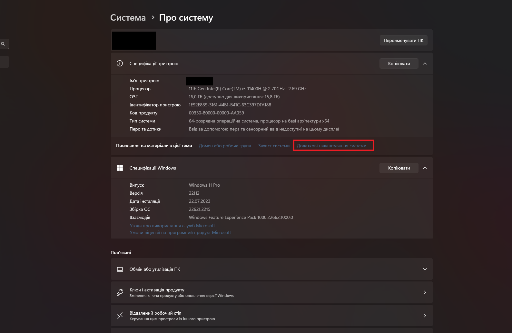
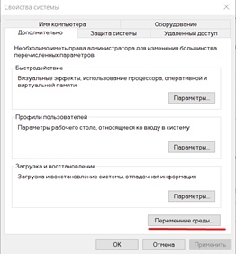
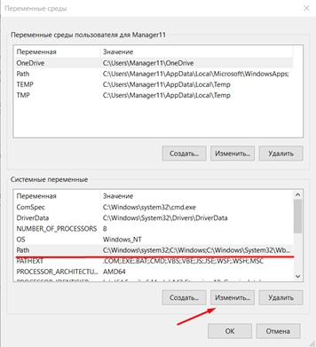
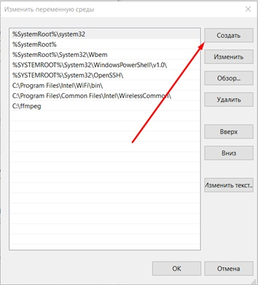
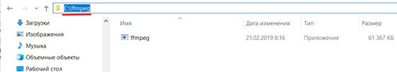

# typescript-convertor
<h1 align="center">Convertor video</h1>
# Installation 
## Installation packages

`npm i`

## Installation ffmpeg

Шаг №1. Встановлення програми

1. Ви завантажили архівний файл і Вам необхідно його відкрити;
2. Відкриваємо завантажений архівний файл, усередині якої розташовується файл-додаток "ffmpeg.exe";
4. Далі заходимо в провідник (іконка "лупа") і знаходимо "Мій комп'ютер". Натискаємо на нього правою кнопкою миші та обираємо "властивості", після чого з'явиться таке вікно:

  

5. Натискаємо на "Додаткові параметри системи" і заходимо в "змінні середовища";

  

6. Знаходимо у віконці "системні застосовані" пункт "Path", натискаємо "змінити";

  

7. У вікні, що з'явилося, натискаємо на кнопку "створити" і вказуємо шлях до файлу ffmpeg. Для цього переходимо в папку з ffmpeg і натискаємо на рядок, виділений червоним (див. на зображенні), після чого натисніть поєднання клавіш Ctrl+C;

  

  

8. Після того, як натиснули клавішу "Створити" (1), вставляємо скопійоване в рядок (2) і натискаємо на "Ок" (3).

## Запуск відеоконвертера

`node ./dist/app.js`
